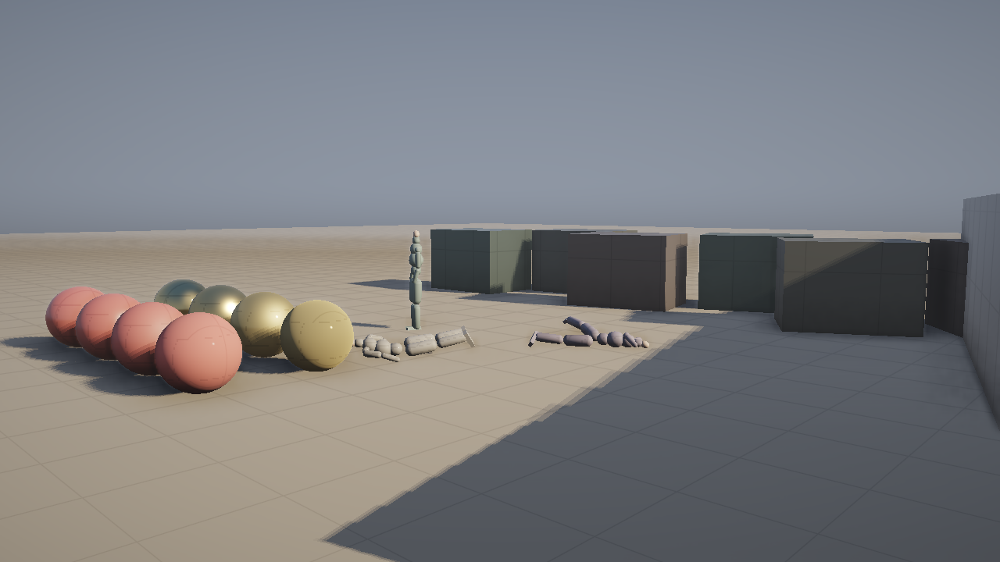
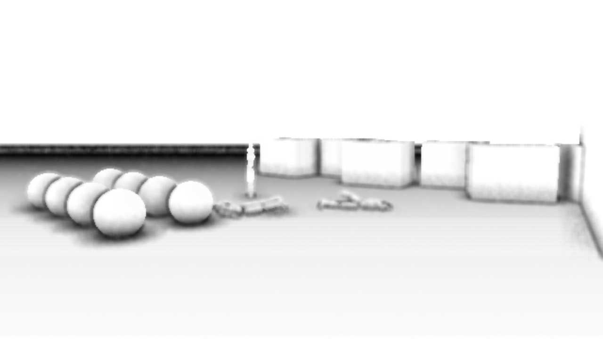
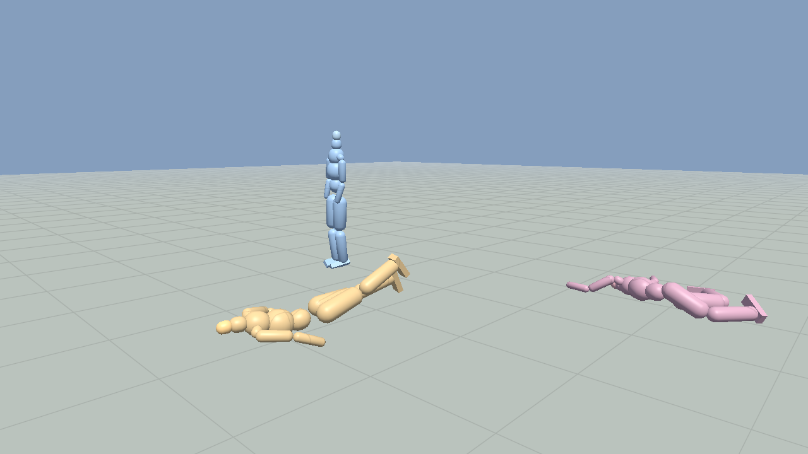
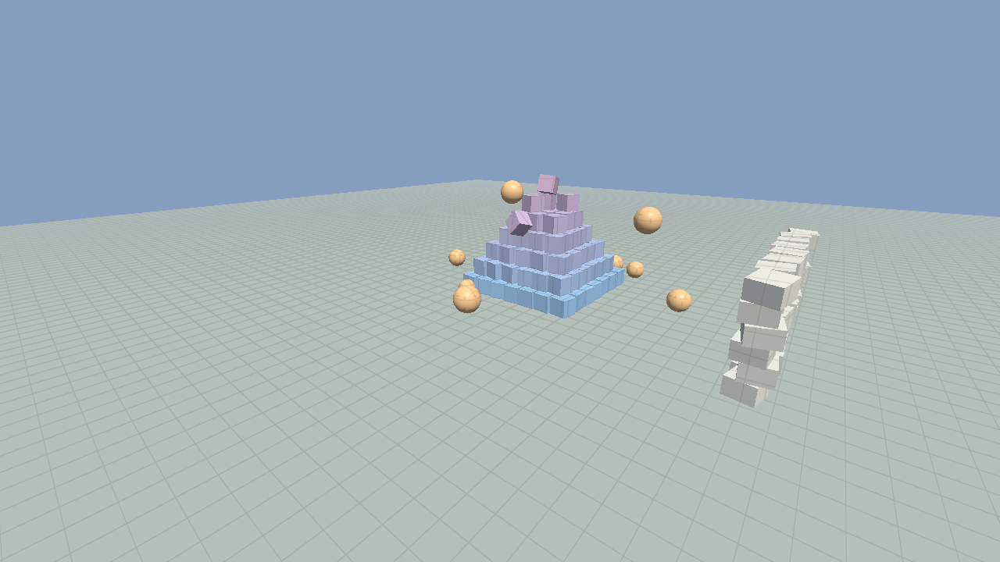
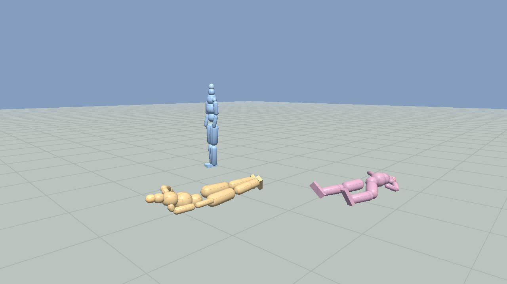
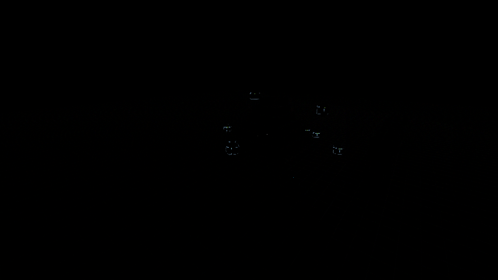

# 3D-движок на Free Pascal + OpenGL 3.3 + GLFW

Небольшой, но полноценный движок: рендерер на современном OpenGL и
физика твёрдых тел на алгоритмах **GJK** и **EPA**.

Код намеренно написан в **процедурном стиле**: только записи (`record`),
модульные переменные и обычные функции. Ни одного класса, объекта,
интерфейса или дженерика — так же, как это делали в движках Pangea Software
и в Quake III Arena. При этом сами алгоритмы и структуры данных подобраны
под современное железо.

## Структура

| Файл | Назначение |
|------|------------|
| `src/umath.pas`    | векторы, матрицы, кватернионы, AABB, пирамида видимости |
| `src/uglfw.pas`    | биндинг GLFW 3.3 (окно, ввод, таймер) |
| `src/ugl.pas`      | загрузчик точек входа OpenGL 3.3 Core |
| `src/umesh.pas`    | вершинные буферы, VAO, инстансные буферы, генераторы примитивов |
| `src/urender.pas`  | шейдеры, камера, инстансная отрисовка, отладочные линии |
| `src/ugjk.pas`     | выпуклые формы, функции поддержки, **GJK**, **EPA**, луч по выпуклому телу |
| `src/uphysics.pas` | тела, широкая фаза, манифолды, решатель импульсов, засыпание |
| `src/ugeom.pas`    | генераторы примитивов, раскладка вершин и экземпляров (без OpenGL) |
| `src/ucamera.pas`  | камера и пирамида видимости (без OpenGL) |
| `src/uskel.pas`    | скелет, позы, анимационные клипы, скиннинг |
| `src/uragdoll.pas` | рэгдол: кости как тела, суставы с анатомическими пределами |
| `src/ubehave.pas`  | процедурные реакции тела в духе Euphoria |
| `src/ufox.pas`     | отложенный конвейер в духе Fox Engine (см. ниже) |
| `src/main.pas`     | демо-сцена и главный цикл |
| `tests/test_physics.pas`  | тесты математики, GJK/EPA и решателя |
| `tests/test_render.pas`   | тесты геометрии, раскладки данных и камеры |
| `tests/usoftgl.pas`       | программный растеризатор (границы доверия — в его заголовке) |
| `tests/render_preview.pas`| кадр демо-сцены без видеокарты |
| `tests/test_raster.pas`   | проверка растеризатора против спецификации OpenGL |
| `tests/test_anim.pas`     | тесты скелета, анимации, суставов, рэгдола, поведения |
| `tests/render_ragdoll.pas`| кадр с персонажами (программный растеризатор) |
| `tests/render_ragdoll_gl.pas` | то же через настоящий OpenGL |
| `tests/render_fox.pas`    | кадр через отложенный конвейер |
| `tests/uegl.pas`          | минимальный биндинг EGL для безэкранного контекста |
| `tests/render_gl.pas`     | прогон настоящего OpenGL без экрана и видеокарты |
| `tests/uscene.pas`        | общая сцена для обоих способов отрисовки |

## Сборка

Нужен `fpc` 3.2+ и установленная библиотека GLFW 3.3.

```sh
# Linux (Debian/Ubuntu). Нужен именно -dev: компоновщику передаётся -lglfw,
# а симлинк libglfw.so кладёт как раз пакет разработчика.
sudo apt install fpc libglfw3-dev

# macOS
brew install fpc glfw

make            # оптимизированная сборка (AVX2)
make portable   # без AVX2, для старых процессоров и виртуальных машин
make debug      # с отладочной информацией и проверками диапазонов
make test       # все тесты, OpenGL и GLFW для них не нужны
make render-ragdoll  # кадр с рэгдолом -> build/ragdoll.png
make render-fox      # кадр отложенного конвейера -> build/fox.png
make check-shaders   # прогнать все шейдеры через glslangValidator
make preview    # отрисовать кадр программно -> build/preview.png
make run
```

Бинарник появится в `build/engine3d` (около 240 КБ, без внешних зависимостей
кроме самой GLFW).

Если компилятор лежит не в системе, можно указать его и каталог модулей RTL:

```sh
make FPC=/путь/к/ppcx64 RTL=/путь/к/units/x86_64-linux
```

## Тесты

`make test` прогоняет 182 проверки, и ни одна из них не требует видеокарты
или дисплея, так что всё это годится для CI.

**Физика (49 проверок).** Математика: кватернионы против матриц, обратная
аффинная матрица, slerp, ортонормированный базис. Узкая фаза: глубина и
нормаль EPA для сфер, кубов и капсул, расстояния между телами, лучи.
Симуляция: падение ящика, стопка из пяти ящиков, отскок шара, трение,
туннелирование на большой скорости и нагрузочный прогон на 800 тел.

**Визуальная часть (51 проверка).** Раскладка данных в памяти — размер
вершины 32 байта и экземпляра 80 байт, смещения полей должны совпадать с
теми, что уходят в `glVertexAttribPointer`. Геометрия — число вершин,
единичность нормалей, направление нормалей наружу, обход треугольников
против часовой стрелки (иначе `GL_CULL_FACE` вывернет модель наизнанку),
отсутствие вырожденных треугольников. Камера — соотношение сторон, базис,
отображение ближней и дальней плоскостей в -1 и +1, знак `w` за спиной
камеры, отсечение по пирамиде видимости, матрицы экземпляров. Математика
отложенного конвейера — полная инверсия 4×4 и сферические гармоники.

**Растеризатор превью (25 проверок).** См. раздел про превью.

**Анимация и рэгдол (50 проверок).** Прямая кинематика, смешивание поз,
маски, аддитивные слои, выборка клипов и зацикливание, скиннинг (поза
привязки не двигает вершины, поворот кости двигает их правильно), суставы
(маятник, нерастяжимая цепь, конус, кручение, мотор), рэгдол (сборка,
чтение позы обратно, целость суставов у тряпичной куклы) и поведение
(выигрыш от равновесия, оглушение и восстановление тонуса).

```
итого: 49 пройдено, 0 провалено   (физика)
итого: 58 пройдено, 0 провалено   (визуальная часть)
итого: 25 пройдено, 0 провалено   (растеризатор превью)
итого: 50 пройдено, 0 провалено   (анимация, рэгдол, поведение)
тел: 801, шагов: 240, на шаг: ~22 мс  (худший случай: ни одно тело не спит)
```

Шейдеры дополнительно прогоняются через `glslangValidator` (`make
check-shaders`) — все 17, включая отложенный конвейер, компилируются без
замечаний.

## Предпросмотр без видеокарты

`make preview` строит ту же сцену, гоняет физику 2.5 секунды и рисует кадр
собственным программным растеризатором: та же камера, та же геометрия, те же
матрицы экземпляров и та же модель освещения, что и в шейдере. Результат —
`build/preview.png`:


## Отложенный конвейер в духе Fox Engine



Сделано по разбору кадра Metal Gear Solid V Адриана Куррежа и по
презентации Kojima Productions с GDC 2013 «Photorealism Through the Eyes
of a FOX». Порядок проходов повторяет оригинал:

| № | Проход | Что происходит |
|---|--------|----------------|
| 1 | **G-буфер** | три цели: альбедо + прозрачность; нормаль + коэффициент зависимости шероховатости от угла обзора; шероховатость / металличность / отражательная способность |
| 2 | **Тени** | три каскада для солнца, привязка к сетке текселей, PCF 3×3 |
| 3 | **SSAO** | **два разных алгоритма**, результаты перемножаются — ровно так устроено в Fox Engine |
| 4 | **Освещение** | небо в сферических гармониках + солнце по микрофасетной модели GGX |
| 5 | **Тонмаппинг** | выполняется **сразу**, дальше конвейер идёт в LDR |
| 6 | **Свечение** | яркий проход + четыре итерации размытия Кавасэ |
| 7 | **FXAA** | единственное сглаживание, доступное отложенному рендеру |

Четыре решения взяты у Fox Engine не формально, а по сути:

**Шероховатость, зависящая от угла обзора.** Фирменная черта движка: на
скользящих углах поверхность выглядит глаже и отражает сильнее. Коэффициент
лежит в альфе буфера нормалей, как и в оригинале.

**Два алгоритма SSAO сразу.** Первый — честная полусферическая выборка
вокруг нормали. Второй — «линейное интегральное» SSAO: две симметричные
пары выборок плюс центральная, всего пять обращений к буферу глубины;
оно ловит вогнутости там, где полусферическое шумит. Результаты
перемножаются.



**Тонмаппинг в начале, а не в конце.** Fox Engine делает его рано и
дальше работает в LDR. Чтобы свечение всё-таки знало, какие пиксели были
яркими, **исходная HDR-яркость сохраняется в альфа-канале** — яркий
проход читает именно её, а не цвет. Это ровно тот приём, что описан
в разборе кадра.

**Размытие Кавасэ вместо гауссова.** Четыре прохода по четыре выборки
дают сопоставимый радиус втрое дешевле.

Освещение от неба решено как **irradiance spherical map**: процедурное
небо интегрируется по сфере в девять цветных коэффициентов второго
порядка, шейдер разворачивает их обратно. Константное небо яркости 1 даёт
облучённость ровно π — это проверяется тестом.

### Чего в конвейере нет

Честный список по сравнению с оригиналом: отражений в экранном
пространстве (SSR), глубины резкости со «scatter»-спрайтами, размытия в
движении по буферу скоростей, объёмных облаков, подповерхностного
рассеяния для кожи, бликов объектива и хроматической аберрации,
временного сглаживания. Из перечисленного ближе всего к реализации SSR:
буфер глубины и нормалей для него уже есть.

### Ошибка, которую поймал этот конвейер

Мировая позиция восстанавливалась из буфера глубины через
`m4_inverse_affine`, а матрица вида-проекции **не аффинная**. Функция
молча возвращала мусор: тени ложились не туда, SSAO считал не те
расстояния, туман врал. Добавлена полная инверсия 4×4 `m4_inverse`, и
теперь тест отдельно проверяет, что аффинная версия на перспективной
матрице действительно даёт мусор — иначе проверка была бы пустой.

## Скелетная анимация, рэгдол и реакции тела



На кадре три персонажа из одного и того же кода. Слева — стоит на мышцах
и ловит равновесие. В центре — получил толчок в грудь, выставил руки и
падает. Справа — расслабленная тряпичная кукла.

### Скелет и анимация (`uskel.pas`)

Три разных понятия, которые легко спутать:

* **поза** — локальные трансформы костей относительно родителей;
* **мировые трансформы** — результат прямой кинематики по позе;
* **матрицы скиннинга** — мировая матрица кости, умноженная на обратную
  матрицу привязки.

Кости хранятся так, что родитель всегда идёт раньше ребёнка: прямая
кинематика — один линейный проход по массиву, без рекурсии и стека.
Есть смешивание поз, маски по костям (наложить верх тела поверх низа),
аддитивные слои, клипы с ключами поворота и смещения, зацикливание и
linear blend skinning с автоматической привязкой вершин к костям.

### Суставы в физике (`uphysics.pas`)

Шаровой сустав с эллиптическим конусом и отдельным пределом кручения:
разложение взаимного поворота на swing и twist, ограничение каждой части,
возврат в пределы жёсткой связью. Поверх — **мотор**: он тянет взаимную
ориентацию к заданной с конечным моментом. Выключенный мотор даёт обычный
рэгдол, включённый — мышцы.

Два момента, которые пришлось делать аккуратно:

* связанные тела засыпают только вместе — иначе решатель шлёт импульсы
  спящей кости, та копит их в угловой скорости и при пробуждении
  разлетается;
* упреждающий момент мышцы складывается с выходом регулятора **внутри**
  решателя: приложенный снаружи, он был бы тут же съеден самим мотором.

### Рэгдол (`uragdoll.pas`)

Гуманоид из 21 кости, 17 физических тел и 16 суставов с анатомическими
пределами. Стопа — намеренно плоский ящик, а не капсула: круглая стопа
даёт точечный контакт, и голеностоп физически не может создать момент,
которым тело удерживает равновесие.

Поза читается из физики обратно в том же виде, в каком её выдаёт анимация,
поэтому анимацию и рэгдол можно смешивать покостно.

### Реакции в духе Euphoria (`ubehave.pas`)

Euphoria от NaturalMotion отличается тем, что персонаж не проигрывает
заготовленную анимацию падения, а каждый кадр решает, что делать, исходя
из состояния физики. Здесь реализовано то же самое в малом масштабе:

* **мышечный тонус** — поза отрабатывается моторами с конечной силой;
  удар сбивает тонус, он восстанавливается за несколько десятых секунды;
* **равновесие** — линейная модель перевёрнутого маятника. Управляется не
  сила, а положение центра давления под стопой: `p = kp*смещение +
  kd*скорость`. Центр давления физически не может выйти за стопу — отсюда
  и предел возможностей голеностопа, и момент, когда нужен шаг;
* **шаг** — когда точка захвата ушла за опору, тело переставляет ногу
  под неё;
* **защита** — луч вперёд по скорости центра масс предсказывает удар, и
  руки идут навстречу препятствию;
* **группировка и мельница** — в полёте шея прижимает голову, а руки
  гасят закрутку корпуса.

Измеренный эффект (тест `make test-anim`):

```
устоял: тряпка 0.39 с, только мышцы 1.18 с, с равновесием 4.16 с
падение с двух метров: тонус падает до 0.44 и возвращается к 1.00
```

**Честно о границах.** Это не полноценный контроллер двуногой ходьбы —
такое остаётся исследовательской задачей. Голеностопная стратегия даёт
кратный выигрыш и уверенно держит мелкие возмущения, но на сильном толчке
персонаж всё равно падает: ландшафт параметров регулятора хаотичен,
соседние значения усиления дают от 3 до 9 секунд устойчивости. Выбрана
устойчивая область, а не единичный пик. Шаг переставляет ногу, но
полноценного цикла ходьбы с переносом веса нет.

## Прогон настоящего OpenGL без видеокарты

`make render-gl` создаёт контекст **OpenGL 3.3 core через EGL на платформе
surfaceless** и прогоняет через него тот же код, что и демо: `ugl` грузит
указатели на функции, `urender` отдаёт шейдеры на компиляцию драйверу,
`umesh` создаёт VAO/VBO и буфер экземпляров, дальше
`glDrawElementsInstanced`. Кадр рисуется в framebuffer-объект и читается
обратно через `glReadPixels`.

```
GL_VERSION  : 3.3 (Core Profile) Mesa 26.3.0-devel
GL_RENDERER : softpipe
GLSL        : 3.30
шейдеры скомпилированы драйвером: lit=3 line=6
нарисовано: пол 1, ящиков 188, шаров 8, отсечено 0
```



Те же персонажи, прогнанные через настоящий драйвер (`make render-ragdoll-gl`):



Это закрывает ровно то, чего не мог проверить программный растеризатор:
создание контекста, компиляцию шейдеров настоящим компилятором GLSL,
uniform-переменные, VAO/VBO, совпадение раскладки `TInstance` с тем, что
уходит в `glVertexAttribPointer`, инстансинг и отсутствие ошибок GL.

Этим прогоном найдена настоящая ошибка движка: Free Pascal не маскирует
исключения сопроцессора, а драйвер GL внутри себя делит на ноль и ждёт
тихих `inf`/`nan` — без `SetExceptionMask` демо падает с `EZeroDivide`
в недрах драйвера на любой машине. Исправлено в `main.pas`.

Как в окружении без root, без GPU и с закрытой сетью была получена рабочая
Mesa — отдельно расписано в [docs/headless-gl.md](docs/headless-gl.md).

### Сверка программного превью с настоящим OpenGL

`make compare` рисует один и тот же кадр обоими способами и считает разницу:

```
средняя разница: 0.02 из 255 (0.01%)
  отличие   <=2:  99.95%
  отличие  3..8:   0.01%
  отличие 9..24:   0.04%
```



Расхождения — тонкие контуры на силуэтах сфер: в превью нет мультисэмплинга
и правила «верх-лево» при заполнении. Внутри полигонов освещение, туман,
гамма и глубина совпадают с точностью до округления.

### Насколько превью соответствует OpenGL

Короткий ответ: **сам по себе это не эталон и не доказательство** (хотя
сверка выше показала расхождение в 0.01%). `usoftgl.pas` —
независимая реализация того же конвейера, написанная по спецификации GL.
Совпадения пиксель-в-пиксель с драйвером нет и не проверяется.

Чтобы картинка не врала молча, растеризатор сверяется не сам с собой, а с
формулами из спецификации, посчитанными в тесте независимо и аналитически
(`make test-raster`, 25 проверок):

* отображение NDC в окно, включая направление оси Y (перепутаешь — кадр
  встанет вверх ногами, и это будет выглядеть правдоподобно);
* знак отсечения задних граней относительно правила `GL_CCW`: контрольный
  треугольник проверяется на обход независимо, в координатах с осью Y вверх;
* тест глубины: результат не зависит от порядка отрисовки, а в буфере лежит
  именно `z` из NDC;
* перспективная коррекция: интерполированная мировая точка сверяется с
  пересечением луча и плоскости; тут же проверяется, что аффинная
  интерполяция дала бы ошибку в 100 метров — иначе проверка была бы пустой;
* отсечение по ближней плоскости: ни один закрашенный пиксель не ссылается
  на точку позади камеры;
* сетка через `fwidth`: вблизи размах 0.22, вдали падает в 8 раз, то есть
  муара на горизонте не будет.

Чем превью заведомо **отличается** от настоящего GL (список продублирован в
заголовке `usoftgl.pas`):

* нет мультисэмплинга, хотя демо просит `GLFW_SAMPLES = 4`;
* нет правила «верх-лево» при заполнении: пиксели ровно на общем ребре
  двух треугольников могут закраситься дважды;
* отсечение только по ближней плоскости, остальные пять заменены обрезкой
  прямоугольника в экранных координатах;
* `fwidth` считается конечной разностью по одному пикселю, а видеокарта
  берёт производные по квадрату 2x2;
* `Single` на CPU против float32 на GPU: другой порядок операций, FMA,
  округление — побайтового совпадения не будет;
* **фрагментная функция — это ручной перевод шейдера `FS_LIT` на Паскаль.**
  Два разных исходника, и расходятся они молча.

Последний пункт не теоретический: в первой версии превью «аналог» шейдера
рисовал шахматку по чётности, тогда как `FS_LIT` рисует тонкие сглаженные
линии сетки через `fwidth`. Картинка выглядела убедительно и была неправильной.
Сейчас обе функции приведены к одному виду и свойство сглаживания покрыто
тестом, но гарантии синхронности нет — правите шейдер, правьте и `sg_shade`.

Что превью всё-таки ловит и уже поймало: геометрию, нормали, обход
треугольников (на нём и всплыли вывернутые сферы), матрицы камеры и
экземпляров, отсечение по пирамиде видимости. Чего оно не проверяет совсем:
вызовы OpenGL, VAO/VBO, инстансинг, uniform-переменные и работу драйвера —
для этого нужна настоящая видеокарта.

## Управление

| Клавиша | Действие |
|---------|----------|
| `W A S D` | движение |
| `Space` / `Ctrl` | вверх / вниз |
| `Shift` | ускорение |
| мышь | обзор |
| ЛКМ | выстрелить тяжёлым шаром |
| ПКМ | выстрелить ящиком |
| `R` | пересобрать сцену |
| `F1` | отладка: AABB, точки и нормали контактов |
| `F2` | пауза физики |
| `F3` | один шаг физики (в паузе) |
| `Esc` | выход |

В заголовке окна показываются FPS, число тел, число неспящих тел,
число пар широкой фазы, число точек контакта и время шага физики.

## Как устроена физика

Шаг симуляции фиксированный — `1/120` с, картинка между шагами
интерполируется, поэтому поведение не зависит от частоты кадров.

1. **Интегрирование сил** — симплектический Эйлер, затухание не зависит
   от величины шага.
2. **Широкая фаза** — sweep and prune по оси X. Массив индексов почти
   отсортирован с прошлого кадра, поэтому сортировка вставками работает
   за линейное время.
3. **Узкая фаза** — GJK на разности Минковского. Любая форма описывается
   одной функцией поддержки, поэтому пар «форма против формы» не нужно:
   один и тот же код обслуживает сферу, бокс, капсулу и выпуклую оболочку.
   При пересечении запускается EPA и выдаёт нормаль и глубину.
4. **Манифолды** — точки контакта накапливаются между кадрами (до четырёх
   на пару) и хранятся в локальных координатах тел. Это даёт устойчивую
   площадь опоры и позволяет переносить импульсы.
   При первом касании GJK выдаёт всего одну точку, поэтому плоско падающий
   ящик успевал подпрыгнуть и уехать вбок. Лечится приёмом из Bullet: тело A
   чуть доворачивается вокруг четырёх осей, перпендикулярных нормали, и
   повторные запросы сразу дают полную площадку опоры. На установившемся
   контакте этот путь не выполняется.
5. **Решатель** — последовательные импульсы с тёплым стартом и трение по двум
   касательным с конусом Кулона. Проникновение убирается **раздельным
   импульсом**: решатель скоростей энергию не добавляет, а позиционный проход
   разводит тела отдельно. Из-за этого боковой снос ящика при ударе с 4 метров
   упал с 72 мм до 1.4 мм.
6. **Засыпание островами** — соприкасающиеся тела объединяются системой
   непересекающихся множеств, и остров засыпает целиком. Усыплять тела
   поодиночке нельзя: нижний ящик стопки уснёт раньше верхнего, и верхний
   начнёт будить его каждый кадр. Тот же механизм будит остров обратно,
   когда в него что-то прилетает.

## Что сделано ради производительности

* Все данные физики лежат в плоских массивах фиксированного размера —
  за шаг симуляции не происходит ни одной аллокации памяти.
* Симплекс GJK и политоп EPA целиком живут на стеке.
* Вершина занимает ровно 32 байта, экземпляр — 80 байт.
* Вся одинаковая геометрия рисуется одним `glDrawElementsInstanced`:
  сотни ящиков — это один вызов отрисовки, а не сотни.
* Буфер экземпляров «осиротевается» перед записью, чтобы не ждать
  видеокарту (приём buffer orphaning).
* Отсечение по пирамиде видимости делается до заполнения буфера экземпляров.
* Расчёты в `Single`: восемь чисел на регистр AVX.
* Спящие тела исключаются из широкой фазы и не обновляют свой AABB.
* Манифолды ищутся по хеш-таблице с цепочками, а не перебором: иначе
  тысячи пар против тысяч манифолдов давали бы квадратичную сложность.

## Расширение

Чтобы добавить свою форму, достаточно дописать одну ветку в
`shape_support_local` из `ugjk.pas` — GJK, EPA, луч и весь решатель
начнут работать с ней без изменений.
